# Simple Docker

## Part 1. Готовый докер.
- Взять официальный докер образ с nginx и выкачать его при помощи docker pull:
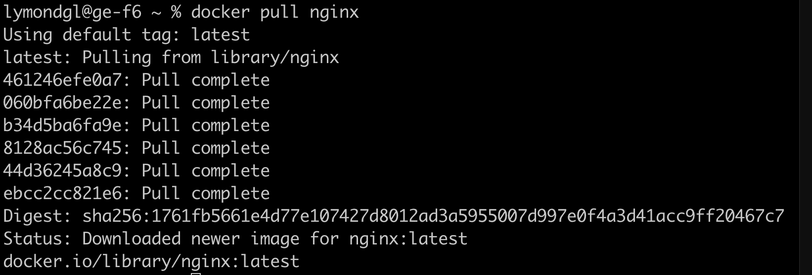
- Проверить наличие докер образа через docker images:
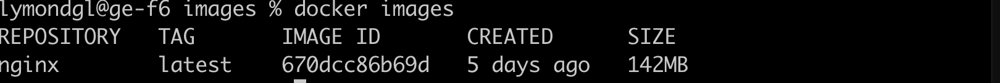
- Запустить докер образ через docker run -d [image_id|repository]
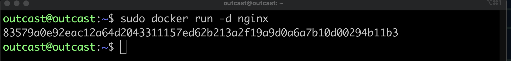
- Проверить, что образ запустился через docker ps
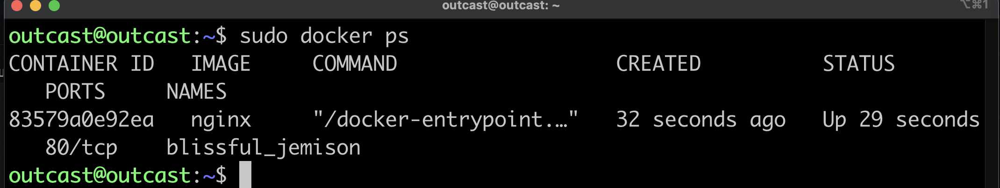
- Посмотреть информацию о контейнере через docker inspect [container_id|container_name]
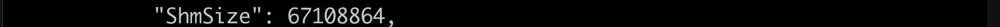

- Остановить докер образ через docker stop [container_id|container_name]
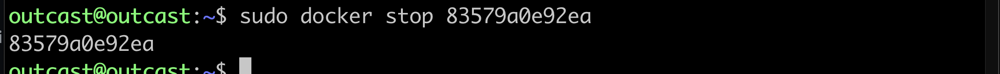
- Проверить, что образ остановился через docker ps
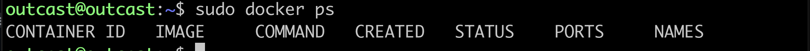
- Запустить докер с замапленными портами 80 и 443 на локальную машину через команду run
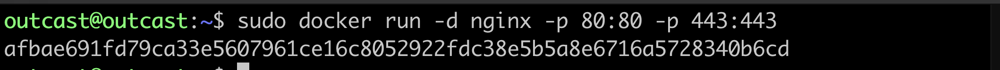
- Проверить, что в браузере по адресу localhost:80 доступна стартовая страница nginx
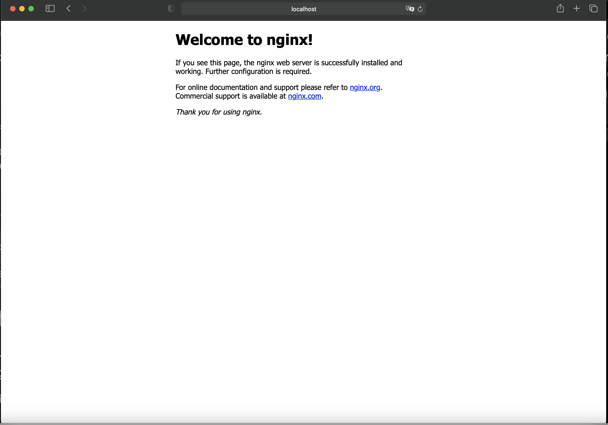
- Перезапустить докер контейнер через docker restart [container_id|container_name]
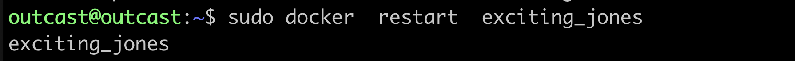
- Проверить любым способом, что контейнер запустился:
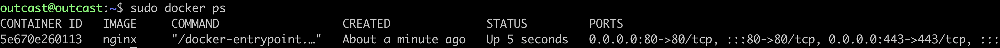
## Part 2. Операции с контейнером.
