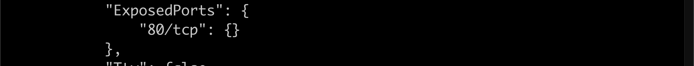
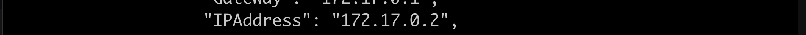
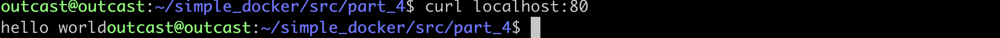

# Simple Docker

## Part 1. Готовый докер.
- Взять официальный докер образ с nginx и выкачать его при помощи docker pull:

- Проверить наличие докер образа через docker images:

- Запустить докер образ через docker run -d [image_id|repository]

- Проверить, что образ запустился через docker ps

- Посмотреть информацию о контейнере через docker inspect [container_id|container_name]

- Остановить докер образ через docker stop [container_id|container_name]

- Проверить, что образ остановился через docker ps

- Запустить докер с замапленными портами 80 и 443 на локальную машину через команду run

- Проверить, что в браузере по адресу localhost:80 доступна стартовая страница nginx

- Перезапустить докер контейнер через docker restart [container_id|container_name]

- Проверить любым способом, что контейнер запустился:

## Part 2. Операции с контейнером.
- Прочитать конфигурационный файл nginx.conf внутри докер образа через команду exec
- 
- Создать на локальной машине файл nginx.conf. Настроить в нем по пути /status отдачу страницы 
- Скопировать созданный файл nginx.conf внутрь докер образа через команду docker cp

- Перезапустить nginx внутри докер образа через команду exec

- Проверить, что по адресу localhost:80/status отдается страничка со статусом сервера nginx

- Экспортировать контейнер в файл container.tar через команду export

- Остановить контейнер

- Удалить образ через docker rmi [image_id|repository], не удаляя перед этим контейнеры

- Импортировать контейнер обратно через команду import

- Запустить импортированный контейнер

## Part 3.
- Установить sudo apt-get install -y libfcgi-dev, sudo, apt-get install -y spawn-fcgi
- Скомпилировать main.c командой gcc main.c -lpthread -lfcgi -o server
- Запустить бинарник командой spawn-fcgi -p 8080 -n ./server
- Проверить, что в браузере по localhost:81 отдается написанная вами страничка

## Part 4.
- Командой sudo docker  build -f Dockerfile -t hello_world:1.0 собираем докре файл
- Запускаем контейнер командой sudo docker run --name my_container  -p 80:81 -v /home/outcast/simple_docker/src/part_4/nginx:etc/nginx -dt hello_world:1.0
Получаем по 80 порту нашу страничку))

